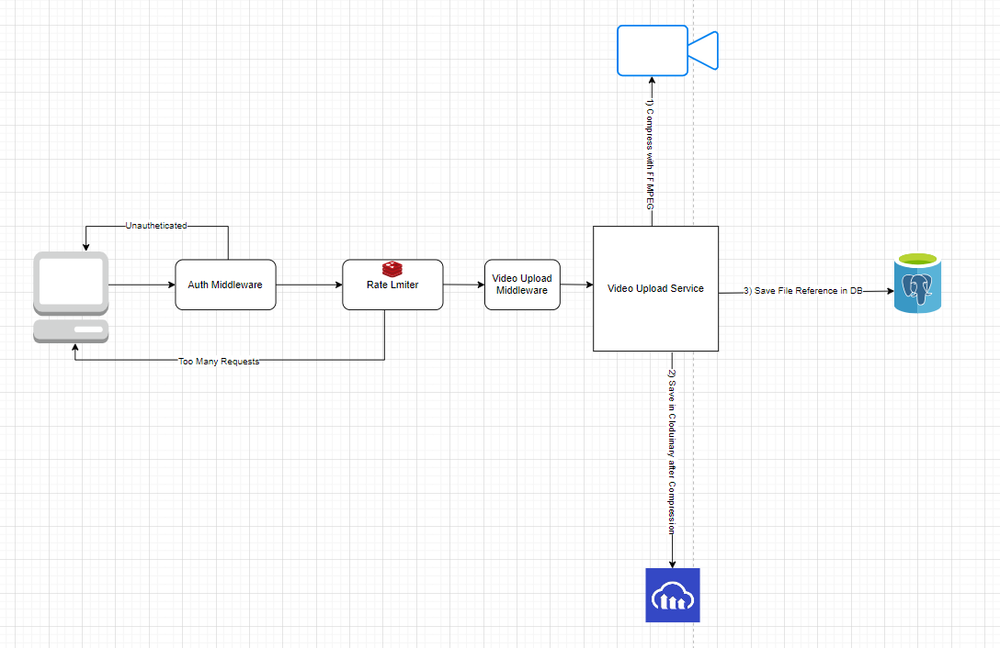

# Video Upload Service

This service allows users to upload videos, convert them into HLS format, and add a watermark before storing them in a cloud storage solution like Cloudinary. The service also provides an API to fetch and play these videos.

## HLD



# HLD Video

[Watch the demo video](./videos/demo.mp4)

## Features

- **Video Upload**: Uploads videos and converts them into HLS format with segment files (`.ts`) and a playlist file (`.m3u8`).
- **Watermarking**: Adds a dynamic, animated watermark (e.g., an email) to the video.
- **Cloud Storage**: Uploads the HLS files to Cloudinary for easy access and streaming.
- **Video Playback**: Provides an API to retrieve the video for playback in a React application.

## Installation

1. Clone the repository:

   ```bash
   git clone https://github.com/Protik111/video-upload-service.git
   ```

2. Install Dependencies for API server:

   ```bash
   yarn install
   ```

3. Install Dependencies for client (After changing directory to client):

   ```bash
   yarn install
   ```

4. Create a `.env` file in the root directory with the following variables:

   ```env
   NODE_ENV=development
   PORT=5000
   DATABASE_URL=""
   JWT_SECRET=''
   JWT_REFRESH_SECRET=''
   JWT_EXPIRES_IN=1d
   JWT_REFRESH_EXPIRES_IN=365d
   VIDEO_COMPRESSED_DIR='http://localhost:5000/uploads/compressed'
   CLOUDINARY_CLOUD_NAME=''
   CLOUDINARY_API_KEY=''
   CLOUDINARY_API_SECRET=''
   REDIS_URL='redis://localhost:6379'
   REDIS_EXPIRATION_TIME=846000
   ```

## Usage Example

- **React Frontend**: Use the provided HLS URL to play the video in a React application using the hls.js library.

## Dependencies

- **TypeScript**
- **Node.js**
- **Express.js**
- **Prisma**
- **Cloudinary**
- **Multer**
- **FFMPEG**
- **REDIS**
- **Video.js**
